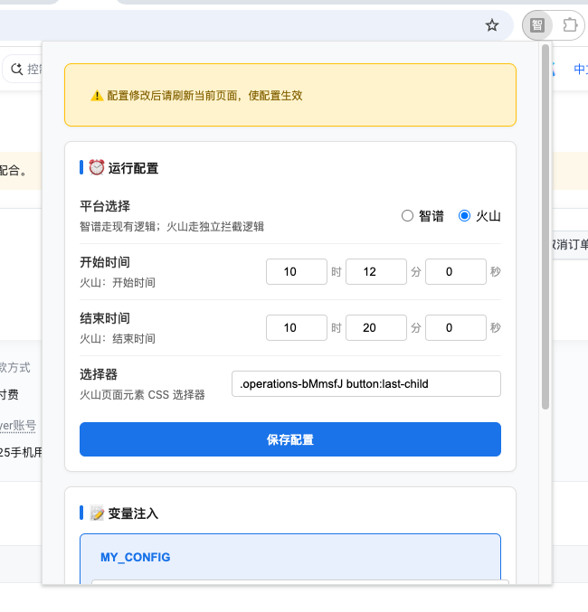

# 该资料仅用来学习使用
## 学习资料答疑群, 可进群交流

# 安装
## 步骤1：点击管理扩展程序

## 步骤2：打开开发者模式

## 步骤3：将文件拖拽进入即可

## 步骤4：智普界面会出现，这样就配置好了

### 智谱配置

# 如果想配置自动点击验证码，接入本地ocr，看项目下的文档自己运行这个文件服务

配置本地ocr  https://{你的本地ip}:9898/click

# 如果想配置自动点击验证码，冰拓1元大概自动点击点击100次（接口比超级鹰慢点，个人感觉还行）
官网：https://www.bingtop.com/
配置

充值即可

如果想配置自动点击验证码，超级鹰1元大概自动点击点击35次
1）注册超级鹰
https://www.chaojiying.com/
2）购买题分

3）软件id  

4）配置即可

点击验证码后，中途无响应是正常的，可以观察下单接口会不断发送的，正常下单成功后会弹出支付弹层，记得出现支付码时要及时付款

### 火山引擎配置

